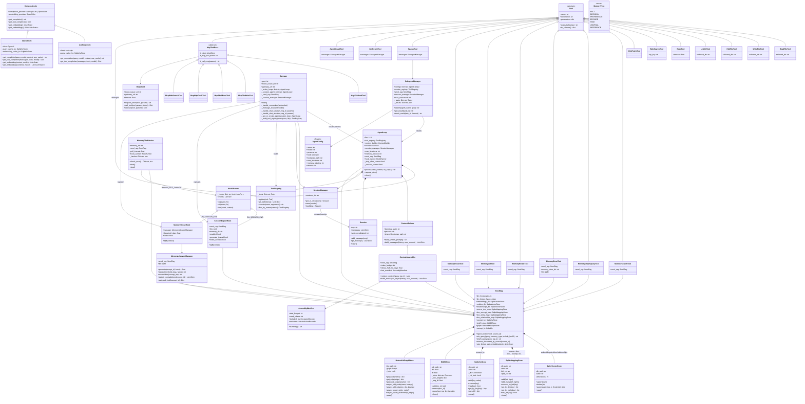

# Legacy Class Diagram

This file is kept as an older class-oriented sketch. The maintained runtime architecture view now lives in [docs/architecture-runtime.md](docs/architecture-runtime.md).

```mermaid
classDiagram
    direction TB

    %% ─────────────────── LLM Layer ───────────────────
    class OpenAiLlm {
        -client: OpenAI
        -query_cache_kv: SqliteKvStore
        -embedding_cache_kv: SqliteKvStore
        +get_completion(query, model, context, use_cache) str
        +get_tool_completion(messages, tools, model) Dict
        +get_embedding(content, model) List~float~
        +get_embeddings(contents, model) List~List~float~~
    }

    class AnthropicLlm {
        -client: Anthropic
        -query_cache_kv: SqliteKvStore
        +get_completion(query, model, context, use_cache) str
        +get_tool_completion(messages, tools, model) Dict
    }

    class CompositeLlm {
        +completion_provider: AnthropicLlm | OpenAiLlm
        +embedding_provider: OpenAiLlm
        +get_completion() str
        +get_tool_completion() Dict
        +get_embedding() List~float~
        +get_embeddings() List~List~float~~
    }

    CompositeLlm o-- AnthropicLlm
    CompositeLlm o-- OpenAiLlm

    %% ─────────────────── Storage Layer ───────────────────
    class SqliteKvStore {
        -db_path: str
        -table: str
        -_db: Connection
        -_init_lock: Lock
        +add(key, value)
        +remove(key)
        +has(key) bool
        +get_by_key(key) Any
        +get_all() dict
        +close()
    }

    class SqliteMappingStore {
        -db_path: str
        -table: str
        -left_col: str
        -right_col: str
        +add(left, right)
        +add_many(left, rights)
        +remove_by_left(key)
        +get_by_left(key) list
        +get_by_right(key) list
        +has_left(key) bool
        +close()
    }

    class SqliteVectorStore {
        -db_path: str
        -table: str
        -dimensions: int
        +upsert(rows)
        +delete(ids)
        +query(query, top_k, threshold) List
        +save()
    }

    class NetworkXGraphStore {
        -file_path: str
        -graph: Graph
        -_lock: Lock
        +get_node(name) dict
        +get_edge(edge) dict
        +get_node_edges(name) list
        +async_add_node(name, kwargs)
        +async_add_edge(src, dst, kwargs)
        +async_upsert_entity_node()
        +async_upsert_relationship_edge()
        +save()
    }

    class BM25Store {
        -db_path: str
        -k1: float
        -b: float
        -_docs: dict~str, Counter~
        -_doc_lengths: dict
        -_avg_dl: float
        +add(doc_id, text)
        +remove(doc_id)
        +query(text, top_k) list~dict~
        +close()
    }

    %% ─────────────────── SmolRag Core ───────────────────
    class SmolRag {
        +llm: CompositeLlm
        +llm_limiter: AsyncLimiter
        +embeddings_db: SqliteVectorStore
        +entities_db: SqliteVectorStore
        +relationships_db: SqliteVectorStore
        +source_doc_map: SqliteMappingStore
        +doc_excerpt_map: SqliteMappingStore
        +doc_entity_map: SqliteMappingStore
        +doc_relationship_map: SqliteMappingStore
        +excerpt_kv: SqliteKvStore
        +bm25_store: BM25Store
        +graph: NetworkXGraphStore
        +excerpt_fn: Callable
        +ingest_text(content, source_id)
        +mix_query(query, memory_type, include_bm25) str
        +bm25_query(query, top_k) str
        +remove_document_by_source(source_id)
        +rate_limited_get_embedding(text) List~float~
    }

    SmolRag *-- SqliteVectorStore : embeddings/entities/relationships
    SmolRag *-- SqliteMappingStore : source↔doc, doc↔excerpt, etc.
    SmolRag *-- SqliteKvStore : excerpt_kv
    SmolRag *-- BM25Store
    SmolRag *-- NetworkXGraphStore

    %% ─────────────────── Tool System ───────────────────
    class Tool {
        <<abstract>>
        +name: str*
        +description: str*
        +parameters: dict*
        +execute(kwargs) str*
        +to_schema() dict
    }

    class ToolRegistry {
        -_tools: Dict~str, Tool~
        +register(tool: Tool)
        +get_definitions() List~dict~
        +execute(name, arguments) str
        +filter_by_names(names) ToolRegistry
    }

    ToolRegistry o-- Tool : manages

    class ReadFileTool { +allowed_dir: str }
    class WriteFileTool { +allowed_dir: str }
    class EditFileTool { +allowed_dir: str }
    class ListDirTool { +allowed_dir: str }
    class ExecTool { +timeout: float }
    class WebSearchTool { -api_key: str }
    class WebFetchTool

    class MemorySearchTool { +smol_rag: SmolRag }
    class MemoryGraphQueryTool { +smol_rag: SmolRag }
    class MemoryStoreTool {
        +smol_rag: SmolRag
        +memory_docs_dir: str
        +llm: LLM
    }
    class MemoryRelateTool { +smol_rag: SmolRag }
    class MemoryGetTool { +smol_rag: SmolRag }
    class MemoryRecallTool { +smol_rag: SmolRag }

    class McpToolBase {
        <<abstract>>
        #_client: McpClient
        #_mcp_tool_name: str
        #_call_mcp(params) str
    }
    class McpFileReadTool
    class McpFileWriteTool
    class McpShellExecTool
    class McpHttpFetchTool
    class McpWebSearchTool

    class SpawnTool { +manager: SubagentManager }
    class GetResultTool { +manager: SubagentManager }
    class AwaitResultTool { +manager: SubagentManager }

    Tool <|-- ReadFileTool
    Tool <|-- WriteFileTool
    Tool <|-- EditFileTool
    Tool <|-- ListDirTool
    Tool <|-- ExecTool
    Tool <|-- WebSearchTool
    Tool <|-- WebFetchTool
    Tool <|-- MemorySearchTool
    Tool <|-- MemoryGraphQueryTool
    Tool <|-- MemoryStoreTool
    Tool <|-- MemoryRelateTool
    Tool <|-- MemoryGetTool
    Tool <|-- MemoryRecallTool
    Tool <|-- SpawnTool
    Tool <|-- GetResultTool
    Tool <|-- AwaitResultTool
    Tool <|-- McpToolBase
    McpToolBase <|-- McpFileReadTool
    McpToolBase <|-- McpFileWriteTool
    McpToolBase <|-- McpShellExecTool
    McpToolBase <|-- McpHttpFetchTool
    McpToolBase <|-- McpWebSearchTool

    MemorySearchTool --> SmolRag
    MemoryGraphQueryTool --> SmolRag
    MemoryStoreTool --> SmolRag
    MemoryRelateTool --> SmolRag
    MemoryGetTool --> SmolRag
    MemoryRecallTool --> SmolRag

    %% ─────────────────── Session ───────────────────
    class Session {
        +key: str
        +messages: List~Dict~
        +last_consolidated: int
        +add_message(msg)
        +get_history(n) List~Dict~
        +clear()
    }

    class SessionManager {
        +sessions_dir: str
        +get_or_create(key) Session
        +save(session)
        +load(key) Session
    }

    SessionManager --> Session : creates/persists

    %% ─────────────────── Context ───────────────────
    class ContextBuilder {
        +bootstrap_path: str
        +persona: str
        +shared_bootstrap_path: str
        +build_system_prompt() str
        +build_messages(history, user_content) List~Dict~
    }

    class ContextAssembler {
        +smol_rag: SmolRag
        +token_budget: int
        +decay_half_life_days: float
        +last_manifest: AssemblyManifest
        +retrieve_context(query, top_k) tuple
        +build_messages_async(history, user_content) List~Dict~
    }

    class AssemblyManifest {
        +total_budget: int
        +used_tokens: int
        +included: List~InclusionRecord~
        +excluded: List~InclusionRecord~
        +summary() str
    }

    ContextBuilder <|-- ContextAssembler
    ContextAssembler --> SmolRag
    ContextAssembler --> AssemblyManifest

    %% ─────────────────── Hooks ───────────────────
    class HookRunner {
        -_hooks: Dict~str, List~HookFn~~
        +on(event, fn)
        +off(event, fn)
        +fire(event, context)
        +events: List~str~
    }

    class SessionExportHook {
        +smol_rag: SmolRag
        +llm: LLM
        +memory_dir: str
        +enabled: bool
        +generate_journal: bool
        +index_session: bool
        +__call__(context)
    }

    class MemoryDecayHook {
        +manager: MemoryLifecycleManager
        +threshold_days: float
        +factor: float
        +__call__(context)
    }

    HookRunner o-- SessionExportHook : ON_SESSION_END
    HookRunner o-- MemoryDecayHook : ON_SESSION_END

    %% ─────────────────── Memory Lifecycle ───────────────────
    class MemoryType {
        <<enum>>
        FACT
        DECISION
        PREFERENCE
        EPISODE
        TASK
        JOURNAL
        REFERENCE
    }

    class MemoryLifecycleManager {
        +smol_rag: SmolRag
        +llm: LLM
        +promote(excerpt_id, boost) float
        +decay(threshold_days, factor) int
        +consolidate(excerpt_ids) str
        +detect_contradictions(excerpt_id) List~Dict~
        +get_audit_trail(excerpt_id) Dict
    }

    MemoryDecayHook --> MemoryLifecycleManager
    MemoryLifecycleManager --> SmolRag
    SessionExportHook --> SmolRag

    %% ─────────────────── Agent Loop ───────────────────
    class AgentLoop {
        +llm: LLM
        +tool_registry: ToolRegistry
        +context_builder: ContextBuilder
        +session: Session
        +session_manager: SessionManager
        +max_iterations: int
        +memory_window: int
        +smol_rag: SmolRag
        +hook_runner: HookRunner
        -_stop_after_current: bool
        -_session_started: bool
        +process(user_content, on_output) str
        +request_stop()
        +close()
    }

    AgentLoop *-- ToolRegistry
    AgentLoop *-- ContextBuilder
    AgentLoop *-- Session
    AgentLoop *-- HookRunner
    AgentLoop --> SessionManager
    AgentLoop --> SmolRag

    class AgentConfig {
        <<frozen>>
        +name: str
        +model: str
        +persona: str
        +tools: List~str~
        +bootstrap_path: str
        +max_iterations: int
        +memory_window: int
        +timeout: int
    }

    class SubagentManager {
        +configs: Dict~str, AgentConfig~
        +master_registry: ToolRegistry
        +smol_rag: SmolRag
        +session_manager: SessionManager
        +max_concurrent: int
        -_tasks: Dict~str, Task~
        -_results: Dict~str, str~
        +spawn(agent_name, goal) str
        +get_result(task_id) str
        +await_result(task_id, timeout) str
    }

    SubagentManager --> AgentLoop : creates
    SubagentManager --> AgentConfig
    SpawnTool --> SubagentManager

    %% ─────────────────── Gateway ───────────────────
    class Gateway {
        +port: int
        +token_issuer_url: str
        +gateway_url: str
        -_active_loops: dict~str, AgentLoop~
        -_session_agents: dict~str, AgentLoop~
        -_smol_rag: SmolRag
        -_session_manager: SessionManager
        +start()
        -_handle_connection(websocket)
        -_message_loop(websocket)
        -_handle_chat_send(ws, req_id, params)
        -_handle_chat_abort(ws, req_id, params)
        -_get_or_create_agent(session_key) AgentLoop
        -_build_tool_registry(workspace, llm) ToolRegistry
    }

    class McpClient {
        +token_issuer_url: str
        +gateway_url: str
        +timeout: float
        +request_token(tool, params) str
        +call_tool(tool, params, token) Dict
        +execute(tool, params) Dict
    }

    Gateway --> AgentLoop : creates/caches
    Gateway --> SmolRag
    Gateway --> SessionManager
    Gateway --> ToolRegistry : builds
    Gateway --> SessionExportHook : registers
    Gateway --> MemoryDecayHook : registers
    McpToolBase --> McpClient

    %% ─────────────────── File Watcher ───────────────────
    class MemoryFileWatcher {
        +memory_dir: str
        +smol_rag: SmolRag
        +poll_interval: float
        +hook_runner: HookRunner
        -_hashes: Dict~str, str~
        +check_once() Dict~str, str~
        +start()
        +stop()
    }

    MemoryFileWatcher --> SmolRag
    MemoryFileWatcher --> HookRunner : fires ON_FILE_CHANGE
```
