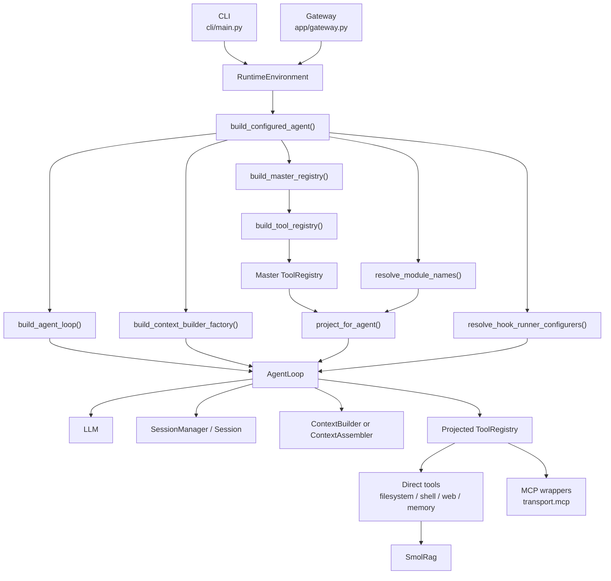
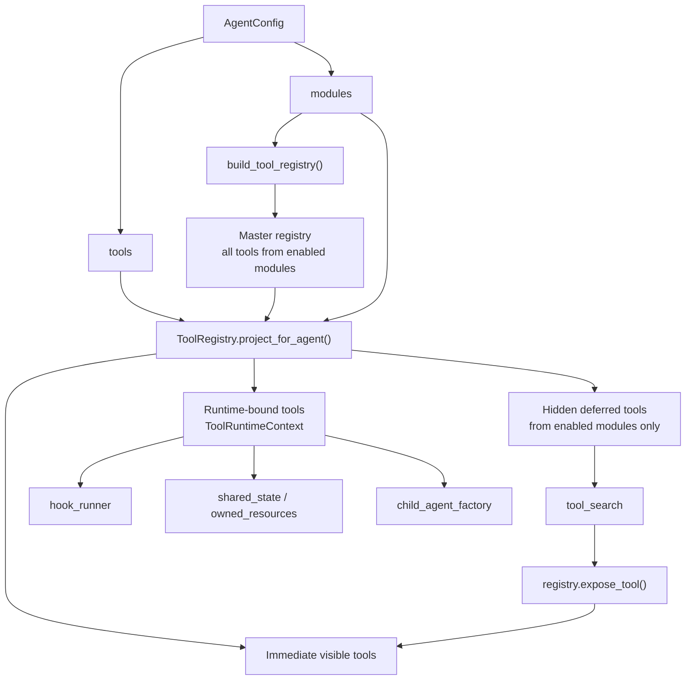
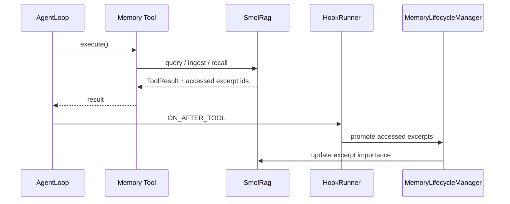
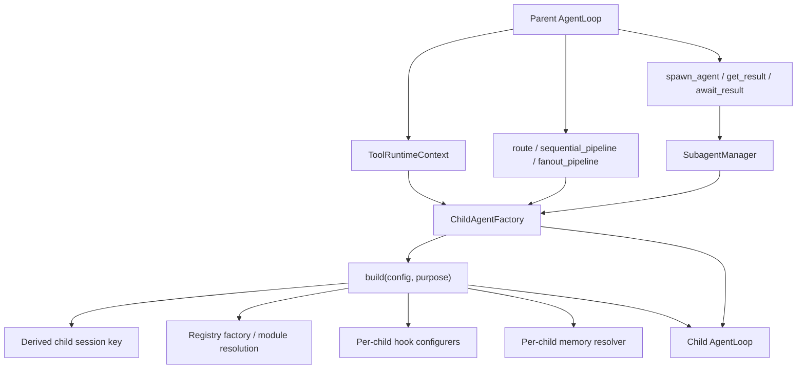

# SmolClaw Runtime Architecture

This document describes the current runtime architecture of SmolClaw as implemented in the repo today.

It is intentionally narrower than the product draft in `smolclaw-spec.md`. That draft mixes current behavior with planned capabilities. This page is the maintained source of truth for how the CLI, gateway, agent runtime, tool registry, memory layer, and child-agent orchestration currently work together.

## At A Glance

SmolClaw is a cohesive runtime with controlled dynamic behavior.

- CLI and gateway both assemble agents through the same runtime core.
- `modules` define the supply boundary for an agent.
- `tools` define the initial visible tool set for that agent.
- Deferred tools stay discoverable only inside enabled modules.
- Runtime-bound tools receive loop-specific context, hooks, session state, and child-agent factories.
- Orchestration and spawned subagents build child loops through the same agent factory path rather than through special-case code.

This is dynamic composition, not self-modifying runtime behavior. The system adapts its available capabilities per agent config and transport mode, but it does so through explicit wiring and projection rules.

## 1. Request And Runtime Flow

### What This Means

- The CLI and gateway do not own separate agent implementations. They differ mainly in transport and lifecycle wiring, but both end up at `build_configured_agent()`.
- `RuntimeEnvironment` carries the shared dependencies and mode switches: transport, workspace, session manager, agent configs, subagent support, and memory backend.
- `build_configured_agent()` resolves the agent's module list, builds a master registry for those modules, chooses the right context builder, installs hook configurers, and then hands everything to `build_agent_loop()`.
- `build_agent_loop()` creates the actual loop instance, binds runtime context into tools, projects the registry to the agent's allowed tool surface, and applies middleware and permission mode restrictions.

## 2. Dynamic Tool Surface

### Key Rules

- `modules` decide what classes of tools may exist for an agent at all.
- `tools` decide what the agent sees immediately in its starting tool definitions.
- Deferred tools are retained for runtime discovery only if they came from enabled modules.
- `tool_search` is exposed automatically when an agent has hidden deferred tools to discover.
- Binding happens after projection, so the tool instances in a live loop carry loop-specific context such as hooks, session data, shared runtime state, and child-agent factory access.

### Important Dynamic Properties

- Transport can be swapped at runtime: `transport.direct` gives local filesystem/shell/web tools, while `transport.mcp` swaps those for MCP-backed wrappers.
- Memory can be disabled per agent by omitting the `memory` module, which also removes memory hooks and the memory-aware context assembler.
- Orchestration and subagent modules are enabled from the runtime environment and then constrained again per agent config.

## 3. Memory And Hook Flow

### Current Behavior

- Memory hooks are installed only when the agent has memory enabled.
- Memory search and memory recall both surface accessed excerpt ids.
- The after-tool promotion hook promotes excerpts surfaced by those memory tools so recall/search affects future ranking.
- Direct callers outside an agent loop can still trigger promotion where the tool itself preserves that behavior, but inside a normal agent loop the hook path is the main mechanism.

## 4. Delegation And Child Agents

### What Is Shared vs Isolated

- Child agents reuse the same factory path as top-level agents, so module resolution, registry projection, hooks, and memory policy stay consistent.
- Session keys are derived from the parent session plus agent name and purpose, so child runs are isolated but traceable.
- Child agents can receive different modules and memory access than their parent if their own config says so.
- `SubagentManager` manages spawned tasks and results, while orchestration helpers create short-lived child loops for sequential, fanout, and route workflows.

## Current Invariants

- CLI chat and gateway chat both rely on the same runtime core.
- Module-aware registry projection prevents agents from discovering deferred tools from disabled modules.
- Memory hooks are installed only when memory is enabled for that agent.
- `tool_search` only exposes deferred tools that already exist within the projected registry.
- Child agents are created through `ChildAgentFactory`, not ad hoc loop construction in tool code.

## Reading Guide

If you are extending the runtime, the main architectural seams are:

1. `RuntimeEnvironment` for shared dependencies and transport/runtime toggles.
2. `AgentConfig.modules` and `AgentConfig.tools` for capability boundaries.
3. `build_tool_registry()` for adding reusable runtime modules.
4. `ToolRegistry.project_for_agent()` for controlling visibility vs discoverability.
5. `ChildAgentFactory` for preserving consistent behavior across delegated agent execution.

For historical context:

- `smolclaw-spec.md` is a broader product draft.
- `diagram.md` is an older class-oriented sketch.

This file is the maintained runtime view.
