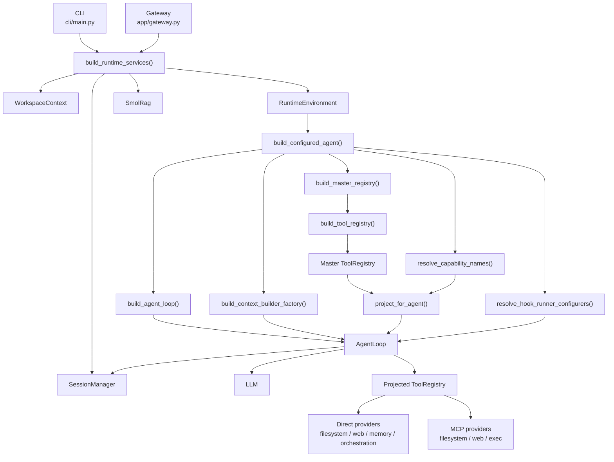
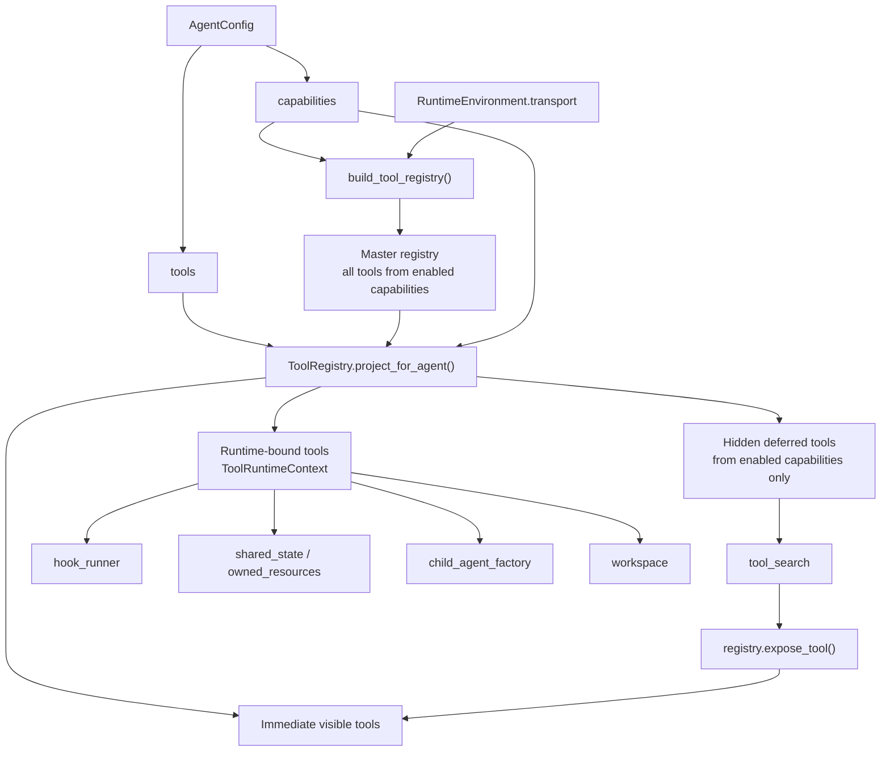
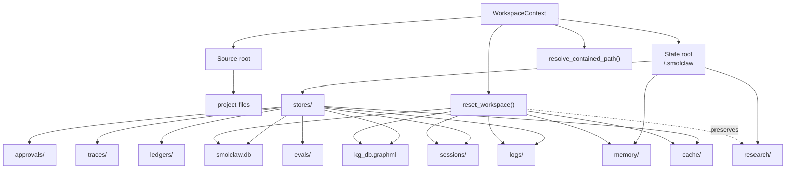
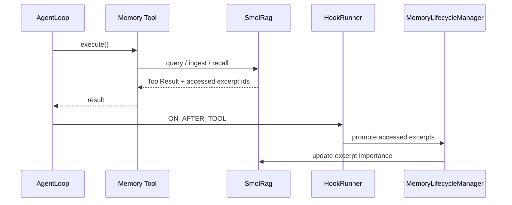
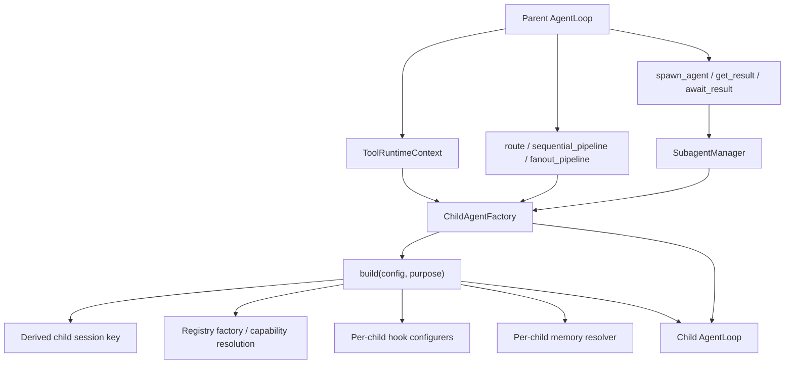

# SmolClaw Runtime Architecture

This document describes the current runtime architecture of SmolClaw as implemented in the repo today.

It is the maintained source of truth for how the CLI, gateway code path, workspace model, agent runtime, tool registry, memory layer, and child-agent orchestration currently work together. Product direction and planned reliability work live in `docs/reliability-roadmap.md`.

## At A Glance

SmolClaw is a cohesive runtime with controlled dynamic behavior.

- CLI and gateway both assemble agents through the same runtime builder.
- `capabilities` define the supply boundary for an agent.
- `tools` define the initial visible tool set for that agent.
- Transport is chosen by the runtime, not by agent config.
- Deferred tools stay discoverable only inside enabled capabilities.
- Runtime-bound tools receive loop-specific context, hooks, session state, workspace ownership, and child-agent factories.
- Orchestration and spawned subagents build child loops through the same agent factory path rather than through special-case code.

This is dynamic composition, not self-modifying runtime behavior. The system adapts its available capabilities per agent config and transport mode, but it does so through explicit wiring and projection rules.

## 1. Request And Runtime Flow

### What This Means

- The CLI and gateway do not own separate agent implementations. They differ mainly in transport and lifecycle wiring, but both end up at the same runtime builder and `build_configured_agent()`.
- `WorkspaceContext` is the ownership boundary for source access and runtime state. In normal runs the source root is the project and the state root is `<workspace>/.smolclaw`; in isolation modes the source root can be a temporary worktree while `.smolclaw/` state remains under the original workspace.
- `RuntimeEnvironment` carries the shared dependencies and mode switches: transport, workspace, session manager, agent configs, subagent support, and memory backend.
- `build_configured_agent()` resolves an agent's capability list, builds a master registry for those capabilities, chooses the right context builder, installs hook configurers, validates that requested tools are satisfiable for the current transport, and then hands everything to `build_agent_loop()`.
- `build_agent_loop()` creates the actual loop instance, binds runtime context into tools, projects the registry to the agent's allowed tool surface, and applies middleware and permission mode restrictions.
- Every live agent registry runs tool hooks, permission/path policy, exploration safety, and checkpoint middleware before filesystem mutations reach the underlying tool.

## 2. Dynamic Tool Surface

### Key Rules

- `capabilities` decide what classes of tools may exist for an agent at all.
- `tools` decide what the agent sees immediately in its starting tool definitions.
- Deferred tools are retained for runtime discovery only if they came from enabled capabilities.
- `tool_search` is exposed automatically when an agent has hidden deferred tools to discover.
- Binding happens after projection, so the tool instances in a live loop carry loop-specific context such as hooks, session data, workspace ownership, shared runtime state, and child-agent factory access.

### Important Dynamic Properties

- Transport can be swapped at runtime: direct runtimes bind local workspace-aware filesystem and web providers, while gateway runtimes bind MCP wrappers for those same capabilities.
- Agent configs no longer select providers directly. A gateway runtime cannot be forced back onto local direct tools by config.
- Memory can be disabled per agent by omitting the `memory` capability, which also removes memory hooks and the memory-aware context assembler.
- Orchestration and subagent capabilities are enabled from the runtime environment and then constrained again per agent config.
- Direct local shell execution is intentionally disabled until a real sandbox backend exists. If `shell` is requested on direct transport, runtime construction fails fast.
- Permission middleware is installed for every permission mode, including `full`, so secret-path and external-path denial is structural rather than prompt-only.

## 3. Workspace Ownership And Reset

### Current Behavior

- Relative filesystem tool paths resolve against the source root by default.
- Absolute filesystem tool paths are allowed only when they remain inside the source root.
- Runtime state paths resolve under the state root. For normal local use this is `<workspace>/.smolclaw`; for isolated worktree runs it is the original workspace's `.smolclaw` directory.
- Run traces live under `.smolclaw/stores/traces/` as JSONL plus summaries. `/trace`, `/trace list`, and `/trace events` consume those files rather than operational logs.
- Goal ledgers, approvals, checkpoints, sessions, memory, and eval artifacts follow the same state-root rule.
- Active goal ledgers persist long-running loop state: latest run id, loop status (`idle`, `running`, `waiting`, `paused`, `complete`, or `blocked`), turn count, stop reason, timestamps, and pending approval count.
- Local policy denies `.env` and `.env.*` paths except example/template files, and denies command working directories outside the workspace.
- `reset_workspace()` is workspace-owned rather than `data_dir`-owned, so the runtime clears mutable state consistently across the new layout.
- `.smolclaw/research/` is preserved across reset because it is treated as source material rather than derived mutable state.

## 4. Memory And Hook Flow

### Current Behavior

- Memory hooks are installed only when the agent has memory enabled.
- Memory search and memory recall both surface accessed excerpt ids.
- The after-tool promotion hook promotes excerpts surfaced by those memory tools so recall and search affect future ranking.
- Direct callers outside an agent loop can still trigger promotion where the tool preserves that behavior, but inside a normal agent loop the hook path is the main mechanism.

## 5. Delegation And Child Agents

### What Is Shared vs Isolated

- Child agents reuse the same factory path as top-level agents, so capability resolution, provider selection, registry projection, hooks, and memory policy stay consistent.
- Session keys are derived from the parent session plus agent name and purpose, so child runs are isolated but traceable.
- Child agents can receive different capabilities and memory access than their parent if their own config says so.
- `SubagentManager` manages spawned tasks and results, while orchestration helpers create short-lived child loops for sequential, fanout, and route workflows.

## Current Invariants

- CLI chat and gateway chat both rely on the same runtime builder.
- Capability-aware registry projection prevents agents from discovering deferred tools from disabled capabilities.
- Transport is selected by runtime and cannot be overridden by agent config.
- Memory hooks are installed only when memory is enabled for that agent.
- `tool_search` only exposes deferred tools that already exist within the projected registry.
- Mutation tools create file checkpoints under the workspace state directory and `/undo` restores the latest non-conflicting checkpoint for the active session.
- Child agents are created through `ChildAgentFactory`, not ad hoc loop construction in tool code.
- Goal loops update the durable ledger when a run starts and finishes, so `/goal status`, non-interactive run JSON, and future resume logic can distinguish normal waiting from paused runs caused by stop requests, iteration limits, errors, or pending approvals.
- Direct local shell is not part of the shipped direct runtime path until a real sandbox exists.

## Reading Guide

If you are extending the runtime, the main architectural seams are:

1. `WorkspaceContext` for workspace ownership, path resolution, and reset boundaries.
2. `RuntimeEnvironment` for shared dependencies and transport/runtime toggles.
3. `AgentConfig.capabilities` and `AgentConfig.tools` for capability boundaries.
4. `build_tool_registry()` for adding transport-specific providers for a capability.
5. `ToolRegistry.project_for_agent()` for controlling visibility vs discoverability.
6. `ChildAgentFactory` for preserving consistent behavior across delegated agent execution.

For product direction and reliability priorities, read `docs/reliability-roadmap.md`.

This file is the maintained runtime view.
