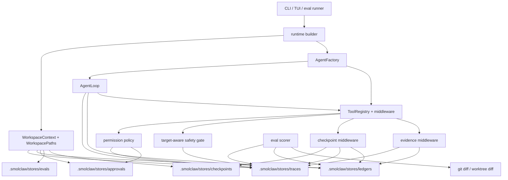

# Next Phase Implementation Design

Date: 2026-06-23

This document turns the next reliability recommendations into implementation-level work that fits the runtime described in [architecture-runtime.md](architecture-runtime.md) and the evidence in [research-agentic-coding-harnesses.md](research-agentic-coding-harnesses.md).

## Scope

The next phase should make SmolClaw's work inspectable and measurable:

1. Goal ledger v1
2. Trace export v1
3. Local agent eval harness
4. Configurable permissions and approvals
5. Worktree or sandbox isolation
6. Target-aware exploration gate
7. Project bootstrap

The first three should be implemented together as one coherent run-recording path. Permissions, isolation, exploration, and bootstrap can then build on that path.

## Implementation Snapshot

This branch has already implemented the foundation for most of the phase:

| Piece | Current state | Remaining work |
| --- | --- | --- |
| Workspace paths | `WorkspacePaths` includes `traces_dir`, `ledgers_dir`, `approvals_dir`, and `evals_dir`; reset and workspace docs know about them. | Keep source-root/state-root split covered as new worktree entrypoints are added. |
| Trace export v1 | `RunTraceStore` and `RunTraceRecorder` write JSONL events and atomic summaries; `AgentLoop` emits run, turn, LLM, tool, safety, and error events; `/trace` shows latest summary; `/trace list`, `/trace events`, and `/trace replay` browse stored run history through shared renderers; file contents and patch arguments are summarized by size and hash. | Add richer TUI trace drawer. |
| Goal ledger v1 | `GoalLedgerStore` replaces simple goal sidecars with acceptance criteria, plan state, evidence ids, changed files, verification, blockers, and legacy migration; shared status renderers can combine latest trace and ledger state. | Tighten completion UX and make ledger state visible in more final-run surfaces. |
| Evidence middleware | Tool evidence and verification commands are automatically recorded into the active ledger and trace; `ledger.updated` events include ledger path, evidence id, related trace event id, provider tool-call id, and originating `tool.started` trace event id; read/search/status/diff evidence joins to the originating tool event; filesystem mutations can carry a `reason` into checkpoint, trace, and ledger evidence. | Surface evidence joins more clearly in eval reports and trace drawers. |
| Eval harness | Mock eval mode exists for deterministic harness plumbing; recorded mode scores saved trace/ledger/diff artifacts without model calls; live mode runs `smolclaw run` in a copied fixture workspace with explicit model, turn, and timeout controls; eval scoring includes trace/ledger integrity; eval reports embed shared `RunStatusView` data, text, failure classes, failed-check details, and recommended next actions; suite output aggregates check rates and optional baseline score deltas; `tests/fixtures/agent_tasks/python_parser_bug` provides the first local coding fixture. | Add more realistic fixtures and wire suite score deltas into CI. |
| Permission policy | Policy objects are loaded from explicit/user/workspace policy files and enforced by `PolicyPermissionMiddleware`; existing hard-deny and mode-deny invariants remain; `ask` creates durable exact-call approvals with detail views and trace metadata. | Add session-pattern approvals. |
| Worktree isolation | `WorktreeRunner` can create isolated clean worktrees or copy dirty repos; non-interactive `run --worktree` can export diffs while keeping runtime state in the original workspace; interactive chat/TUI can run in an isolated worktree and expose `/worktree status`, `/worktree diff`, `/worktree apply`, and `/worktree discard`. | Harden dirty-copy behavior and apply-back review. |
| Target-aware exploration | `SafetyState` records structured exploration evidence and checks target relevance for mutation tools; filesystem mutation schemas expose optional mutation reasons. | Tune relevance to avoid both false unlocks and unnecessary blocks. |
| Project bootstrap | `init_project_guidance()` creates or updates a managed `AGENTS.md` block, detects common test commands, is available through `smolclaw init`, chat `/init`, and TUI `/init`, and is tested against the first eval fixture. | Add more fixture coverage for generated guidance. |

The phase is therefore no longer only a design proposal. The remaining work is integration hardening: making the new pieces share state cleanly, exposing them consistently across CLI/TUI/evals, and closing the safety gaps that appear once these pieces interact.

## Architecture Fit

Current runtime anchor points:

- `app/runtime_builder.py`
  - Builds `WorkspaceContext`, `SessionManager`, and shared runtime services.
  - This is where new workspace stores should be created and passed through.

- `app/definitions.py`
  - Owns canonical workspace paths.
  - Add new directories here, not as ad hoc paths in CLI code.

- `app/agent_factory.py`
  - Builds `ToolRuntimeContext`, `HookRunner`, `SafetyState`, permissions, safety, and checkpoint middleware.
  - This is the right place to bind a ledger store, trace store, approval controller, and eval/run metadata into each loop.

- `app/agent_loop.py`
  - Owns turn boundaries, LLM calls, tool calls, stop reasons, usage, and goal continuation.
  - This is the right place to emit run/turn/LLM/tool trace events and update the active goal ledger.

- `app/tools/registry.py`
  - Owns final tool invocation and middleware execution.
  - This remains the enforcement path for permissions, approvals, safety, checkpoints, and traceable tool results.

- `app/tools/safety.py`
  - Tracks git status/search/read evidence and blocks mutation.
  - Upgrade this to emit structured exploration evidence and target-file checks.

- `app/tools/permissions.py`
  - Currently enforces mode-level denial plus hard-deny secret/external path rules.
  - Extend this into a policy engine while preserving hard-deny safety invariants.

- `app/goal.py`
  - Currently stores one simple goal sidecar per session.
  - Extend or replace this with a ledger-backed goal state.

- `app/diagnostics.py` and `app/tracing.py`
  - Diagnostics is operational JSONL and log output.
  - `app/tracing.py` is optional OTEL spans.
  - Do not overload either as the durable agent trajectory. Add a separate trace store and optionally mirror events to diagnostics/OTEL.

## How The Pieces Fit Together

The phase should be understood as one run-recording spine with policy and isolation wrapped around it:



Runtime ownership rules:

- `WorkspacePaths` owns where state lives. New stores must enter through `app/definitions.py`, not through ad hoc CLI paths.
- `AgentFactory` owns per-loop wiring. It constructs stores, middleware, shared state, safety state, permissions, and child-agent behavior.
- `AgentLoop` owns run and turn lifecycle. It starts traces, increments ledger turns, emits model/tool lifecycle events, and records final stop reasons.
- `ToolRegistry` and middleware own side-effect enforcement. Permission checks, exploration gates, checkpoints, and evidence recording must stay next to tool execution, not in prompts.
- CLI/TUI/eval code should be consumers of trace and ledger state. They should not create their own shadow formats for progress, verification, or final status.

### Component Fit Matrix

| Component | Architectural owner | Inputs | Outputs | Primary consumers |
| --- | --- | --- | --- | --- |
| Goal ledger | `app/goal_ledger.py`, goal tools, `AgentLoop` | objective, acceptance criteria, plan updates, tool evidence, stop reason | `.smolclaw/stores/ledgers/<session>.ledger.json` | goal prompt context, `/goal status`, eval scorer, final run JSON |
| Trace export | `app/run_trace.py`, `AgentLoop`, middleware | run metadata, LLM events, tool calls, permissions, safety, checkpoints, errors | `.smolclaw/stores/traces/<session>/<run>.jsonl` and summary JSON | `/trace`, TUI status/log surfaces, eval scorer, debugging |
| Evidence middleware | `app/tools/evidence.py` | command results, git status/diff, reads/searches, verification-like commands | ledger evidence plus trace events | goal completion gate, eval scoring, user status |
| Permission policy | `app/tools/policy.py`, existing permissions middleware | tool name, capability, file path, command prefix, agent mode, future config | allow/ask/deny decision and trace event | tool registry, approvals, eval safety checks |
| Approval requests | `app/approvals.py`, policy middleware, CLI/TUI approval commands | ask decisions, session key, tool name, argument hash, approval action | `.smolclaw/stores/approvals/<session>.approvals.json` | policy middleware, `/approval status`, `/approval approve`, `/approval deny` |
| Worktree isolation | `app/worktree.py`, CLI runtime setup | base repo, run id, dirty-copy flag | isolated source root, diff, apply-back path | non-interactive runs, eval harness, future remote work |
| Exploration gate | `app/tools/safety.py` | git status/search/read/diff evidence and mutation target paths | block/allow mutation decision, structured evidence | mutation tools, trace, ledger, eval safety checks |
| Eval harness | `app/agent_eval.py`, `scripts/run_agent_eval.py` | task fixture, mode, isolated workspace, trace, ledger, diff | score report and artifacts | CI, roadmap validation, regression triage |
| Project bootstrap | `app/bootstrap.py`, CLI `init` | repo files and detected commands | managed `AGENTS.md` block | future sessions, eval fixtures, operator guidance |

The most important integration point is `runtime_shared_state["trace_recorder"]`. Middleware can record decisions without changing the middleware protocol. That is pragmatic for v1, but it makes shared-state keys part of the runtime contract. Treat those keys as documented interfaces and keep them stable.

### End-To-End Run Flow

The implementation should be read as one lifecycle, not as independent features:

1. Runtime setup starts from CLI, TUI, gateway, or eval code and builds one `WorkspaceContext`.
2. `WorkspacePaths` decides where durable state lives. In normal mode the source root and state root are the same; in worktree mode the source root is isolated and the state root remains the original workspace.
3. `AgentFactory` creates the per-loop runtime contract:
   - trace store and active recorder;
   - goal ledger store and active ledger;
   - approval store and policy middleware;
   - safety state;
   - checkpoint middleware;
   - shared state keys for active tool trace event ids and provider tool-call ids.
4. `AgentLoop` owns the run lifecycle. It starts the trace, associates the run with the ledger, emits turn and LLM events, and places the active tool ids in shared state while each provider tool executes.
5. `ToolRegistry` and middleware own every side effect. Permission, safety, checkpoint, evidence, and retry behavior happens around the final tool call.
6. Evidence middleware writes compact evidence into the ledger and emits joinable trace events. The trace stores chronology; the ledger stores task state.
7. User-facing surfaces read shared views from the artifacts:
   - `/trace` and `/goal status` read trace summaries and ledgers;
   - eval reports embed `RunStatusView`;
   - future TUI drawers should render the same view models;
   - non-interactive JSON should expose artifact paths and status fields from the same source.
8. Eval scoring treats the trace, ledger, and diff as the source of truth for whether the agent explored, changed, verified, and stopped correctly.

This flow is why the phase should not be split into "trace feature", "ledger feature", and "eval feature" workstreams after v1. Trace, ledger, and eval scoring are now coupled by design: if one changes format or semantics, the other two must be updated and tested together.

### Piece-By-Piece Architecture Fit

Goal ledger:

- Fits as durable task state under `.smolclaw/stores/ledgers/`.
- `AgentLoop` should update lifecycle fields such as run id, turn count, and stop reason.
- Goal tools should update objective, criteria, plan, blocker, and completion status.
- Evidence middleware should append inspected-file, changed-file, command, and verification evidence.
- CLI/TUI/eval code should render ledger views, not mutate ledger internals.
- Problem area: completion can become ceremonial if the agent can mark done without evidence.
- Solution: keep completion gates in the goal store/tool layer and require criteria plus verification or an explicit no-verification reason.

Trace export:

- Fits as durable chronological telemetry under `.smolclaw/stores/traces/`.
- `AgentLoop` should emit run, turn, LLM, and high-level error events.
- Middleware should emit tool, permission, safety, checkpoint, approval, and ledger update events.
- Diagnostics and OTEL can mirror trace information, but neither should become the canonical trajectory store.
- Problem area: traces increase the blast radius of accidental secret capture.
- Solution: keep summarized/redacted payloads as the default and make full local debug traces an explicit opt-in.

Evidence middleware:

- Fits between final tool invocation and durable run artifacts.
- It should observe successful reads, searches, status checks, diffs, commands, verification, and mutations.
- Its output must be small, stable, and joinable: evidence id, tool-call id, active `tool.started` trace event id, related trace event id, summary, path or command, and timestamp.
- Problem area: if evidence is recorded after a tool succeeds but before checkpoint or trace writes complete, artifacts can drift.
- Solution: keep one integration test per evidence class that verifies ledger evidence, trace event, and final summary agree.

Permission policy and approvals:

- Fit as middleware inside the registry execution path.
- Hard-deny and mode-deny are runtime invariants; policy files can only narrow or ask, not bypass structural safety.
- Exact-call approvals are persisted under `.smolclaw/stores/approvals/` and should be checked after hard-deny/mode-deny on retry.
- Problem area: session-pattern approvals are useful but can silently authorize too much.
- Solution: ship exact-call approvals first; add pattern approvals only with explicit pattern display, expiry, trace events, and re-validation against hard-deny rules.

Worktree isolation:

- Fits by changing the `WorkspaceContext.source_root`, not by moving state.
- Filesystem tools, command cwd checks, and mutation safety should scope to the isolated source root.
- Traces, ledgers, approvals, sessions, memory, checkpoints, and eval reports should stay under the original state root.
- Problem area: dirty-copy mode can carry ignored files, secrets, virtualenvs, or stale build output into the run.
- Solution: prefer clean git worktrees; keep dirty-copy explicit; add file-count, byte-count, ignored-root, and secret-path guardrails; move toward applying dirty patches onto clean worktrees.

Target-aware exploration:

- Fits in `SafetyState` and mutation middleware because this is a side-effect precondition, not prompt guidance.
- Exploration evidence should be structured enough to explain denials and score evals.
- Problem area: target relevance is heuristic and can be wrong in both directions.
- Solution: keep v1 denials explainable and conservative; add eval fixtures before tightening thresholds.

Eval harness:

- Fits as a consumer of runtime artifacts, not a parallel runner with its own progress schema.
- Mock mode validates plumbing; recorded mode validates scoring/rendering deterministically; live mode validates model behavior in an isolated workspace.
- Problem area: evals can reward superficial success if they only check final tests.
- Solution: score trace/ledger integrity, exploration, permission/safety behavior, verification, touched files, diff presence, and stop reason.

Project bootstrap:

- Fits as repo-local context generation, not runtime authority.
- It should improve model starting context by writing a managed `AGENTS.md` block with discovered commands and structure.
- Problem area: repo instructions can be stale, hostile, or contradictory to runtime policy.
- Solution: keep `AGENTS.md` out of policy loading and state that middleware wins over repo guidance.

## Problem Areas And Proposed Solutions

### 1. Source Root And State Root Must Stay Separated In Isolation Modes

Problem:

- Default local runs can safely use one directory as both editable source tree and state root.
- Isolation modes need a stricter split: the temporary worktree is the editable source tree, while traces, ledgers, approvals, checkpoints, sessions, memory, and eval artifacts belong to the original workspace.
- Any new runtime path that silently rebuilds `WorkspaceContext` from only the source path can reintroduce state pollution.

Solution:

- Keep `WorkspaceContext` split into source root and state root.
- Keep filesystem tools scoped to `source_root`.
- Keep traces, ledgers, approvals, checkpoints, sessions, memory, and eval reports under `state_root`.
- Add regression tests for every new worktree entrypoint proving state writes stay in the original workspace.
- Do this before promoting worktree mode from non-interactive runs to normal chat/TUI behavior.

### 2. Permission Middleware Must Stay Unified

Problem:

- The policy engine now wraps hard-deny, mode-deny, and loaded policy checks in one middleware path.
- Future changes could accidentally reintroduce parallel permission middleware or let a policy file bypass fixed safety invariants.
- Project-local policy files are useful, but they are repository content and must not be treated as more trusted than runtime safety.

Solution:

- Keep hard-deny checks non-configurable and shared.
- Keep `PolicyPermissionMiddleware` as the runtime-installed permission middleware.
- Preserve old mode tests as compatibility tests against the wrapped mode-deny behavior.
- Load policy files from explicit/user/workspace locations, never from `AGENTS.md`.
- Let trusted user/explicit rules precede workspace rules; merge default actions conservatively so project files can make behavior stricter but cannot bypass hard or mode denies.
- Add trace assertions for each decision: matched rule, action, reason, and whether the hard-deny layer short-circuited.

### 3. `ask` Has Exact-Call Resumability, Not Broad Approval UX

Problem:

- V1 creates durable pending approval requests and allows the exact same tool call to proceed once after approval.
- It does not yet support approving a pattern for the rest of the session.
- It does not automatically replay a paused tool call; the agent or user must retry the same call.
- This is intentionally narrow for command tools, external paths, and future remote-origin requests.

Solution:

- Keep `ApprovalRequestStore` under `.smolclaw/stores/approvals/`.
- Store canonical tool name, normalized arguments, policy decision, requested scope, session key, run id, and expiry.
- Approval should resolve one of:
  - once for the exact tool call hash;
  - session rule for a specific command prefix/path glob/tool;
  - deny.
- Tool execution after approval must re-run hard-deny checks and verify the call hash or approved pattern.
- Current implementation supports exact once approvals. Add session-pattern approvals only after the UI can show the matched pattern clearly.
- Do not enable broad shell or external-directory writes until pattern approvals, sandbox/worktree isolation, and remote trust boundaries are mature.

### 4. Ledger And Trace Can Drift Apart

Problem:

- The trace is append-only run history.
- The ledger is mutable current task state plus compact evidence.
- If middleware records one but not the other, evals and user status can disagree.

Solution:

- Treat trace event ids as the join key for ledger evidence where possible.
- When middleware records ledger evidence, emit `ledger.updated` with the ledger path, evidence id, and related trace event id.
- Add tests for command evidence, checkpoint evidence, verification evidence, and changed-file evidence proving both artifacts update together.
- Add a small integrity checker used by evals:
  - every ledger verification evidence has a matching trace event;
  - every checkpoint referenced by the ledger exists;
  - final trace status and ledger status are compatible.

Current implementation status:

- Ledger evidence, command evidence, verification evidence, and changed-file records have stable ids.
- `ledger.updated` trace events include `ledger_path`, `evidence_id`, and `related_trace_event_id`.
- Eval scoring includes `trace_ledger_integrity`, checking verification trace ids, checkpoint ids, and compatible final statuses.

### 5. Tool Arguments And Results Can Leak Sensitive Data

Problem:

- Tool calls may include patches, file contents, command output, environment-like values, or user secrets.
- Trace export makes this durable and easier to inspect, which also makes accidental leakage more durable.

Solution:

- Keep trace defaults as summarized and redacted.
- Store full command output or file content only under an explicit local debug flag.
- Redact by key name and value shape, not only by exact field names.
- For mutation events, store target path, action, content hash, checkpoint id, and diff size rather than full content.
- Add regression tests with `.env`, token-looking values, multiline patches, and command output containing secret-looking strings.

Current implementation status:

- Trace event payloads pass through `diagnostics.redact()`.
- File content, edit text, multiline strings, and patch text are summarized as size plus SHA-256 prefix rather than raw durable trace content.

### 6. Target-Aware Exploration Can Be Too Strict Or Too Loose

Problem:

- Path relevance is enforceable, but imperfect.
- A broad search at repo root may be enough for small repos but too weak for large ones.
- A narrowly relevant read can still miss related call sites.
- New files cannot be read before creation.

Solution:

- Keep the v1 gate simple: require git status plus relevant search/read/diff evidence; require direct read before editing existing files; require parent-directory evidence before adding files.
- Filesystem mutation tools accept optional `reason` fields and record them into checkpoint metadata, trace events, and ledger changed-file evidence.
- For larger repos, add a future "exploration budget" score based on target file, parent directory, symbol search, and tests.
- Make safety denials actionable by naming the missing evidence: status, target read, parent listing, or relevant search.

### 7. Eval Modes Are Uneven

Problem:

- Mock evals prove harness plumbing.
- They do not measure real model behavior.
- Live evals are expensive and nondeterministic.
- Recorded evals replay saved artifacts deterministically, but they only prove scoring/rendering/integrity against prior trajectories.

Solution:

- Keep mock evals in CI for deterministic safety.
- Keep recorded eval mode for replaying saved traces, ledgers, diffs, and command outputs through scoring without model calls.
- Add live eval mode as opt-in local or scheduled smoke, with explicit model, cost, and timeout controls.
- Score behavior from trace and ledger, not only final tests:
  - relevant exploration happened;
  - forbidden paths stayed untouched;
  - verification command ran;
  - completion had acceptance evidence;
  - stop reason was explicit.

### 8. Worktree Dirty-Copy Mode Can Hide Real-World Hazards

Problem:

- Copying a dirty repo can include ignored build artifacts, virtualenvs, caches, or local secrets if exclusions are incomplete.
- Copy mode may not behave like git worktree mode for submodules, file modes, symlinks, or ignored files.

Solution:

- Prefer clean git worktrees for normal use.
- Keep dirty-copy mode explicit (`--copy-dirty-worktree`) and mark reports as dirty-copy runs.
- Exclude known state and cache roots by default.
- Add size and file-count guardrails before copying.
- Consider applying a generated dirty patch onto a clean worktree as the safer v2 path.

### 9. Bootstrap Guidance Is Context, Not Policy

Problem:

- `AGENTS.md` improves future sessions, but it is repo content and can be stale or hostile.
- Generated guidance can accidentally become long, prescriptive, or contradictory to runtime safety.

Solution:

- Keep the managed block short and fact-based.
- Preserve user content but only replace the managed block.
- Never load permissions from `AGENTS.md`.
- State in system/runtime docs that structural policy wins over repo instructions.
- Use bootstrap output in eval fixtures to test whether generated guidance improves behavior without weakening safety.

### 10. CLI, TUI, And Eval Surfaces Can Diverge

Problem:

- The same run can be started from chat, TUI, non-interactive CLI, or eval runner.
- If each surface formats status, approvals, traces, and final results independently, behavior will drift.

Solution:

- Keep trace and ledger formatting helpers shared.
- Add parity tests for `/trace`, `/goal status`, approval-needed results, and worktree status across plain CLI and TUI.
- Make non-interactive `run` the canonical eval entrypoint and keep its JSON schema stable.
- Treat TUI as a richer renderer over the same runtime artifacts, not a separate runtime.


## Proposed State Layout

Extend `WorkspacePaths`:

```text
.smolclaw/
  stores/
    sessions/
    checkpoints/
    traces/
      <session-key>/
        <run-id>.jsonl
        <run-id>.summary.json
    ledgers/
      <session-key>.ledger.json
    approvals/
      <session-key>.approvals.json
    evals/
      runs/
      reports/
```

Path rules:

- Use `contained_storage_path()` and atomic writes for every path derived from a session key, run ID, eval ID, or task ID.
- Keep trace JSONL append-only for run events.
- Keep ledger JSON as current-state plus compact event history.
- Keep eval artifacts under `.smolclaw/stores/evals/`, but eval fixtures should live under `tests/fixtures/agent_tasks/`.

Problem:

- Current `GoalStore` writes `*.goal.json` into `.smolclaw/stores/sessions/`.

Solution:

- Keep backward compatibility for existing goals, but move new ledger state to `.smolclaw/stores/ledgers/`.
- During `GoalStore.load()`, if no ledger exists but a legacy goal file exists, convert it in memory and save a ledger on next write.

## 1. Goal Ledger V1

### Purpose

Replace "goal status plus note" with a structured task state that the agent, CLI, TUI, traces, and evals can all inspect.

### Data Model

Add `app/goal_ledger.py`.

Core dataclasses:

```python
GoalLedger(
    schema_version: int,
    session_key: str,
    goal_id: str,
    run_id: str | None,
    objective: str,
    status: Literal["active", "complete", "blocked"],
    created_at: float,
    updated_at: float,
    turn_count: int,
    acceptance_criteria: list[AcceptanceCriterion],
    plan: list[PlanStep],
    current_step_id: str | None,
    inspected_files: list[EvidenceRef],
    changed_files: list[ChangedFileRef],
    commands: list[CommandEvidence],
    verification: list[VerificationEvidence],
    blockers: list[Blocker],
    stop_reason: str | None,
    notes: list[LedgerNote],
)
```

Minimum v1 fields:

- `objective`
- `status`
- `acceptance_criteria`
- `plan`
- `inspected_files`
- `changed_files`
- `commands`
- `verification`
- `blockers`
- `stop_reason`
- `turn_count`

Acceptance criteria:

```python
AcceptanceCriterion(
    id: str,
    description: str,
    status: Literal["pending", "satisfied", "not_applicable"],
    evidence: list[str],
)
```

Evidence refs:

```python
EvidenceRef(
    kind: Literal["read", "search", "status", "diff", "command", "test", "checkpoint"],
    path: str | None,
    tool_call_id: str | None,
    trace_event_id: str | None,
    summary: str,
    timestamp: float,
)
```

### Tools

Extend existing goal tools instead of adding unrelated names:

- `goal_start(objective, acceptance_criteria=None)`
- `goal_status()`
- `goal_update(status=None, note=None, plan=None, current_step=None, acceptance_updates=None)`
- `goal_record_evidence(kind, summary, path=None, command=None, status=None)`

Problem:

- Letting the model freely rewrite a whole ledger risks corrupting state.

Solution:

- Expose narrow update operations.
- Use tool-side validation for status transitions and accepted evidence kinds.
- Keep append-style event history internally even when the rendered ledger is current-state.

### Agent Loop Integration

In `AgentLoop.process()`:

1. At turn start, ensure an active ledger has a `run_id`.
2. Increment `turn_count`.
3. Insert a compact ledger summary as the goal context message.
4. On final assistant response, record `stop_reason`:
   - `assistant_final`
   - `max_iterations`
   - `stop_requested`
   - `blocked`
   - `error`

In `_goal_context_message()`:

- Render a concise ledger summary:
  - objective
  - current plan step
  - pending acceptance criteria
  - files already inspected/changed
  - verification still needed
  - blockers

Problem:

- A full ledger can become context spam.

Solution:

- Store full ledger on disk.
- Render only the compact summary into the prompt.
- Put full details in traces and `/goal status`, not every turn.

### Completion Gate

Before `goal_update(status="complete")` succeeds:

- At least one acceptance criterion must be satisfied or marked not applicable.
- Verification evidence must exist, or the tool call must provide a clear `no_verification_reason`.
- If changed files exist, require at least one verification command or explicit reason.

Problem:

- Strict gates can block documentation-only or exploratory goals.

Solution:

- Allow `not_applicable` and `no_verification_reason`, but store them explicitly.
- Make the TUI show "complete with no verification" differently from "complete and verified".

### Tests

- Ledger serialization and migration from legacy `GoalState`.
- `goal_start` with acceptance criteria.
- Completion blocked without criteria/verification.
- Completion allowed with explicit no-verification reason.
- Agent loop turn increments ledger and records final stop reason.
- Compact prompt rendering excludes raw tool logs.

## 2. Trace Export V1

### Purpose

Create a replayable, eval-friendly trajectory independent of operational logs and optional OTEL export.

### Data Model

Add `app/run_trace.py`.

Trace event shape:

```python
RunTraceEvent(
    schema_version: int,
    event_id: str,
    run_id: str,
    session_key: str,
    turn_index: int | None,
    iteration: int | None,
    timestamp: float,
    event: str,
    data: dict,
)
```

Core event names:

- `run.started`
- `run.ended`
- `turn.started`
- `turn.ended`
- `llm.started`
- `llm.ended`
- `tool.started`
- `tool.ended`
- `tool.denied`
- `safety.blocked`
- `permission.decided`
- `approval.requested`
- `approval.resolved`
- `checkpoint.created`
- `undo.applied`
- `ledger.updated`
- `verification.recorded`
- `error`

Trace summary shape:

```python
RunTraceSummary(
    run_id: str,
    session_key: str,
    goal_id: str | None,
    status: Literal["complete", "blocked", "error", "stopped", "unknown"],
    started_at: float,
    ended_at: float | None,
    model: str,
    tool_calls: int,
    denied_tool_calls: int,
    files_changed: list[str],
    commands_run: list[str],
    checkpoints: list[str],
    verification: list[dict],
    stop_reason: str | None,
)
```

### Storage

Add `RunTraceStore`:

- `start_run(session_key, goal_id=None, metadata=None) -> run_id`
- `append(event)`
- `finish(run_id, status, stop_reason=None)`
- `load_events(run_id)`
- `load_summary(run_id)`

Problem:

- JSONL append can be corrupted if the process crashes mid-write.

Solution:

- Write one JSON object per line.
- Tolerate and report the last malformed line on read.
- Write summaries atomically.
- Keep diagnostics separate for operational errors.

### Agent Loop Integration

In `AgentLoop.process()`:

- Start one run per user turn or goal-run turn.
- Emit `turn.started`.
- Wrap each LLM call with `llm.started` / `llm.ended`.
- Emit each tool call before and after `_invoke_tool()`.
- Capture summarized arguments and result preview by default.
- Store full tool result only when it is safe and not too large.

Problem:

- Tool arguments can contain file contents, patches, or secrets.

Solution:

- Reuse and strengthen `diagnostics.redact()`.
- Store summarized arguments by default.
- For mutation tools, store target paths, hashes, and checkpoint IDs rather than full content.
- Allow a debug flag for full local traces, default off.

### Middleware Integration

Trace decisions where they happen:

- `PermissionMiddleware` emits `permission.decided` and `tool.denied`.
- `SafetyMiddleware` emits `safety.blocked` and structured exploration evidence.
- `CheckpointMiddleware` emits `checkpoint.created`.
- Policy approval handling emits `approval.requested` / `approval.resolved`.

Implementation detail:

- Add `trace_recorder` to `ToolRuntimeContext.shared_state`.
- Middleware reads it from bound runtime context where possible.
- For middleware that currently does not know runtime context, wrap it in a small class constructed in `agent_factory.py` with the trace recorder.

Problem:

- Current middleware signature only receives `tool`, `kwargs`, `next_fn`; it does not receive runtime context.

Solution:

- Prefer constructor injection from `agent_factory.py`.
- Avoid changing the middleware protocol until necessary.

### CLI/TUI Integration

- `/trace` prints the current run trace path and summary.
- `/trace list` prints recent summaries for the session.
- `/trace events [run_id] [limit]` prints compact redacted event lines for the latest or named run.
- `/trace replay [run_id]` prints a compact full trajectory for the latest or named run.
- `/init` creates or updates managed `AGENTS.md` project guidance in both plain chat and TUI.
- TUI details/log drawer can read trace summaries without parsing operational logs.
- `/goal status` can include latest trace summary and verification evidence.

### Tests

- Trace store writes JSONL and summary under `.smolclaw/stores/traces/`.
- CLI and TUI route `/trace`, `/trace list`, and `/trace events` through shared formatting helpers.
- Agent loop emits run, LLM, tool, and final events.
- Denied tool call emits denial event.
- Trace redaction removes secret-looking fields and values.
- Trace read tolerates one trailing malformed line.

## 3. Local Agent Eval Harness

### Purpose

Measure whole-agent behavior instead of only unit-level code paths.

### Fixture Layout

```text
tests/fixtures/agent_tasks/
  python_bugfix/
    task.yaml
    repo/
    expected/
    recorded/
      ledger.json
      trace.summary.json
      trace.jsonl
      diff
      command_outputs.json
  safety_secret_denial/
    task.yaml
    repo/
```

`task.yaml`:

```yaml
id: python_bugfix
prompt: "Fix the failing parser test."
entrypoint: "smolclaw"
verification:
  - ".venv/bin/python -m pytest"
required_evidence:
  - git_status
  - read_target
  - test_command
allowed_files:
  - "src/parser.py"
  - "tests/test_parser.py"
forbidden_files:
  - ".env"
expected_status: complete
```

Recorded mode artifacts:

- `recorded/ledger.json`: serialized `GoalLedger`.
- `recorded/trace.summary.json`: serialized `RunTraceSummary`.
- `recorded/trace.jsonl`: optional full trajectory path for reports.
- `recorded/diff`: optional saved diff copied into eval reports.
- `recorded/command_outputs.json`: optional command-to-output map.

### Runner

Add `scripts/run_agent_eval.py`:

1. Copy fixture repo to a temp workspace or create a git worktree.
2. Start SmolClaw in non-interactive mode.
3. Run one prompt or one goal.
4. Capture:
   - trace JSONL
   - ledger JSON
   - git diff
   - command outputs
   - final assistant response
   - stop reason
5. Score using deterministic checks.
6. Write report to `.smolclaw/stores/evals/reports/` or an explicit `--output`.

Problem:

- Live model evals are nondeterministic and can be expensive.

Solution:

- Support three modes:
  - `mock`: deterministic fake LLM trajectories for CI.
  - `recorded`: replay prior trace/ledger/diff artifacts against scoring and reporting code.
  - `live`: manual or scheduled smoke runs through `smolclaw run`, with explicit `--model`, `--agent`, `--max-turns`, and `--timeout` controls.

Problem:

- The current CLI is interactive-first.

Solution:

- Add a non-interactive command path:
  - `python -m cli.main run --workspace <path> --prompt <text> --max-turns N`
  - optional `--goal`
  - optional `--agent`
  - writes final status, trace path, and ledger path as JSON.

### Scoring

Score dimensions:

- tests passed
- required files touched
- forbidden files untouched
- minimal diff threshold
- exploration evidence present
- verification evidence present
- goal completion justified
- no safety/permission violations
- no unhandled errors

### Tests

- Fixture loader validates schema.
- Mock eval runner produces trace, ledger, diff, report.
- Safety fixture verifies `.env` denial.
- Failure fixture verifies blocked status and stop reason.

## 4. Configurable Permissions And Approvals

### Purpose

Evolve from fixed permission modes to policy objects while preserving current hard-deny protections.

### Policy Model

Add `app/tools/policy.py`.

```python
PermissionAction = Literal["allow", "ask", "deny"]

PermissionRule(
    subject: str,          # tool key, command, path, capability, external_directory
    pattern: str,
    action: PermissionAction,
    reason: str = "",
)

PermissionPolicy(
    default_action: PermissionAction,
    rules: list[PermissionRule],
)
```

Resolution order:

1. Hard-deny invariants:
   - `.env`, `.env.*` except examples/templates
   - paths outside workspace unless explicitly allowed
   - direct shell until sandbox exists
2. Agent mode baseline.
3. User/explicit policy rules.
4. Workspace policy rules.
5. Runtime approval memory for "once" or "always this session".

Problem:

- Existing modes are simple sets; replacing them directly risks regressions.

Solution:

- Keep `PERMISSION_MODES` as baseline policy constructors.
- Add `PolicyPermissionMiddleware` alongside existing `PermissionMiddleware`.
- Migrate tests mode-by-mode before removing old internals.

### Policy File Loading

Supported policy files:

- explicit path from `SMOLCLAW_PERMISSION_POLICY`
- user policy at `~/.config/smolclaw/permissions.yaml`
- user policy at `~/.smolclaw/permissions.yaml`
- workspace policy at `.smolclaw/permissions.yaml`, `.yml`, or `.json`

Shape:

```yaml
default_action: allow
rules:
  - subject: command
    pattern: "npm install*"
    action: ask
    reason: "dependency changes need approval"
  - subject: path
    pattern: "generated/**"
    action: deny
    reason: "generated files are not edited directly"
```

Rules support `subject` values:

- `tool`
- `capability`
- `path`
- `command`

Loading rules:

- User and explicit policy rules are evaluated before workspace rules.
- Default actions are merged conservatively: `deny` beats `ask`, and `ask` beats `allow`.
- Policy files cannot override hard-deny secret/external-path checks or agent mode denies.
- `AGENTS.md` is never read as permission policy.

### Approval UX

CLI:

- When policy returns `ask`, create a durable pending approval instead of executing.
- `/approval status` lists pending approvals.
- `/approval approve <id>` approves one exact pending tool call.
- `/approval deny <id>` denies one pending tool call.
- Retrying the same tool call after approval executes once.

TUI:

- V1 renders approval commands through the same transcript command flow.
- Later, show approval requests in a dedicated modal/status pane, not as raw assistant text.

Non-interactive/eval:

- Default deny unless `--approval-policy` provides answers.

Problem:

- The current tool middleware returns strings and approval ids, not resumable interruption objects.

Solution:

- V1 blocks with a clear `Approval required` tool result, records a pending approval, and lets the next user turn approve.
- V2 should add fuller resumability:
  - automatic replay of the exact pending tool call after approval where the transport supports interruption/resume;
  - session-scoped approvals for clearly displayed command prefixes, path globs, or tools;
  - explicit expiry and audit display for approved patterns.

Recommendation:

- Keep exact-call approvals as the safe default.
- Add session-pattern approvals only with explicit pattern display and trace evidence.

### Tests

- Current permission tests still pass.
- Policy denies command prefix.
- Policy allows specific path glob.
- External directory asks by default.
- Non-interactive ask denies.
- TUI renders approval request without corrupting transcript.

## 5. Worktree Or Sandbox Isolation

### Purpose

Run risky work away from the user's dirty working tree and prepare for remote-origin sessions.

### Worktree V1

Add `app/worktree.py`:

- `WorktreeRunner.create(base_repo, run_id) -> WorktreeContext`
- `WorktreeContext.path`
- `WorktreeContext.diff()`
- `WorktreeContext.apply_back(paths=None)`
- `WorktreeContext.cleanup()`

Agent integration:

- CLI flag: `--worktree` for `chat`, `run`, and `goal run`.
- In worktree mode, build `WorkspaceContext` from the worktree path.
- Keep traces/evals in the original workspace unless explicit `--state-workspace` says otherwise.

Problem:

- Runtime state under `.smolclaw/` inside the worktree can pollute diffs.

Solution:

- In worktree mode, separate source workspace from state workspace:
  - source root: temporary worktree
  - state root: original workspace `.smolclaw/`
- This likely requires `WorkspaceContext` to distinguish `root_dir` from `state_root`.
- V1 alternative: add `.git/info/exclude` entries for `.smolclaw/` in the worktree.

Problem:

- Uncommitted user changes may not be present in a git worktree.

Solution:

- Detect dirty worktree before creating isolation.
- Options:
  - refuse and ask user to commit/stash
  - copy dirty workspace to temp dir instead of git worktree
  - apply a generated patch of dirty changes into the worktree
- V1 should refuse dirty worktrees unless `--copy-dirty` is set.

### Sandbox V2

Abstract later:

```python
SandboxBackend(
    prepare(workspace, run_id) -> SandboxContext,
    run_command(command, cwd, env) -> CommandResult,
    export_diff() -> str,
    cleanup()
)
```

Backends:

- local process
- git worktree
- Docker
- future macOS sandbox/bubblewrap/SSH

### Tests

- Worktree creation/export cleanup.
- Dirty repo refusal.
- Isolated edit does not touch main workspace.
- Diff export excludes `.smolclaw/`.

## 6. Target-Aware Exploration Gate

### Purpose

Make the current safety gate prove relevant exploration, not just any exploration.

### Current State

`SafetyState` tracks:

- `did_git_status`
- `did_search`
- `read_paths`
- repeated identical tool calls

`SafetyMiddleware` already blocks edits to existing target files until those files are read.

### Upgrade

Add structured evidence:

```python
ExplorationEvidence(
    kind: Literal["status", "search", "read", "diff"],
    path: str | None,
    query: str | None,
    tool_call_id: str | None,
    timestamp: float,
)
```

Add target extraction for:

- `write_file`
- `edit_file`
- `apply_patch`
- future command tools tagged `SHELL_WRITE`

Require before mutation:

- git status evidence for workspace state
- search/read evidence relevant to target path or parent directory
- read evidence for existing target files
- explicit mutation reason in tool arguments where practical

Problem:

- Mutation reasons should improve auditability without blocking mechanical or low-risk edits.

Solution:

- Keep mutation `reason` optional.
- Store supplied reasons in checkpoint metadata, `checkpoint.created`, `ledger.updated`, and changed-file ledger evidence.
- Continue to enforce target-path relevance separately; reason text is audit evidence, not a safety bypass.

Problem:

- New files cannot be read first.

Solution:

- Require parent directory listing or search evidence for adds.
- Record "new file" evidence separately.

Tests:

- Search unrelated directory does not unlock edit.
- Reading target file unlocks edit.
- Adding new file requires parent directory evidence.
- Apply patch checks every updated/deleted target.

## 7. Project Bootstrap

### Purpose

Generate concise repo-local guidance that improves future sessions without becoming a substitute for enforcement.

### Command

Add:

```text
/init
python -m cli.main init --workspace <path>
```

Output:

- Create or update `AGENTS.md`.
- Do not overwrite unrelated user content.
- Include a generated block with markers:

```markdown
<!-- smolclaw:init:start -->
...
<!-- smolclaw:init:end -->
```

Sections:

- project structure
- build/test/lint commands
- runtime requirements
- verification workflow
- important docs
- agent safety notes

Problem:

- Auto-generated instructions can become stale or overly prescriptive.

Solution:

- Keep the generated block short.
- Prefer facts discovered from files over style advice.
- Use negative constraints sparingly:
  - do not edit generated files
  - do not run deployment commands without approval
- Include timestamp and command used.

Problem:

- The agent could treat `AGENTS.md` as authority over structural safety.

Solution:

- System prompt and docs should state that policy middleware wins over repo instructions.
- Permission middleware must never read policy from untrusted `AGENTS.md`.

Tests:

- Creates `AGENTS.md` in empty repo.
- Updates only generated block.
- Detects common Python/Node test commands.
- Does not include secrets from `.env`.

## Cross-Cutting Problems And Solutions

### Problem: Too Many Event Formats

Current system has:

- session messages
- diagnostics events
- optional OTEL spans
- checkpoint records
- goal state
- TUI events

Solution:

- Make run trace JSONL the canonical agent trajectory.
- Diagnostics remains operational.
- OTEL mirrors high-level spans only.
- TUI consumes live events during a run and trace summaries after a run.
- Eval harness consumes trace JSONL plus ledger JSON.

### Problem: State Paths Can Sprawl

Solution:

- Add all new roots to `WorkspacePaths`.
- Use storage helpers.
- Include new state roots in reset docs and reset implementation.
- Keep `.smolclaw/research/` preserved; clear traces/evals only if explicitly requested or on reset policy decision.

Recommendation:

- `reset` should clear traces for normal state reset.
- Eval reports can be preserved only if they live outside the workspace or if a `--preserve-evals` flag is added later.

### Problem: Tool Results Can Leak Sensitive Data

Solution:

- Trace redaction by default.
- Secret path hard-deny remains non-configurable for local tools.
- Result previews capped and redacted.
- Full result persistence opt-in only.

### Problem: Approvals Need Resumability

Solution:

- V1: `ask` creates an approval-needed result and stops the tool call.
- V2: store pending tool calls and resume exact calls by approval ID.
- Do not implement broad shell access until approval resumability and sandbox/worktree are both present.

### Problem: Worktree Mode Collides With Workspace State

Solution:

- Short term: exclude `.smolclaw/` from worktree diffs.
- Better: split source root and state root in `WorkspaceContext`.
- Do the better split before remote-control work.

### Problem: Evals Could Reward Superficial Behavior

Solution:

- Score trace evidence, not just final tests.
- Include negative/safety tasks.
- Include dirty-worktree and blocked-task fixtures.
- Require stop reason and verification evidence.

## Phase Completion Plan

The greenfield foundation is now in place. The remaining work is about turning the pieces into one dependable operator workflow instead of a set of parallel artifacts.

### Support Level Matrix

| Piece | Support level | What makes it real | What is still weak |
| --- | --- | --- | --- |
| State roots | Strong for non-interactive paths | `WorkspacePaths` and `WorkspaceContext` separate editable source from durable state, and reset/docs include the new roots. | Every new interactive worktree entrypoint must prove it keeps state in the original workspace. |
| Trace export | Strong for CLI debugging and eval scoring | JSONL events, atomic summaries, redaction, summaries, event browsing, replay, and shared renderers exist. | TUI still lacks a first-class trace drawer. |
| Goal ledger | Strong data model, partial UX | Ledgers track objective, criteria, plan, evidence, changed files, verification, blockers, stop reason, legacy migration, and shared status views. | Completion and status are not yet surfaced consistently in final answers and eval report text. |
| Evidence middleware | Stronger foundation | Verification, changed-file, read, search, status, and diff evidence are recorded into both ledger and trace with stable ids, provider tool-call ids, and originating `tool.started` event ids. | Shared views should expose the joins more clearly for debugging. |
| Eval harness | Good harness, thin benchmark suite | Mock, recorded, and live modes exist, score trace/ledger integrity, copy artifacts, emit shared run-status summaries, classify failures with recommended next actions, and produce suite-level check rates plus baseline score deltas. | Needs more fixtures and CI wiring before it can guide roadmap tradeoffs. |
| Permission policy | Strong v1 enforcement | Hard-deny, mode-deny, loaded rules, durable exact-call approvals, approval detail views, and trace events share one middleware path. | Pattern approvals and automatic replay are intentionally absent and need careful UX before implementation. |
| Worktree isolation | Good local isolation path | `run --worktree` can isolate edits and export diffs while state remains in the original workspace; chat/TUI worktree sessions keep source and state roots separate and expose status, diff, apply, and discard controls. | Dirty-copy guardrails and richer apply-back review are not yet productized. |
| Target-aware safety | Useful v1 | Structured exploration evidence and target checks block unrelated or unread edits. | Relevance scoring is heuristic and can be too strict for generated files or too loose for large repos. |
| Bootstrap | Useful context | `smolclaw init`, `/init`, and TUI `/init` update a managed `AGENTS.md` block. | Needs more fixtures to prove generated guidance improves behavior without becoming policy. |

### Dependency Order

1. Harden the shared presentation layer for traces and ledgers.
   - Owners: `app/run_trace.py`, `app/goal_ledger.py`, new shared formatting helpers, `cli/main.py`, `cli/tui.py`.
   - Reason: approval UX, eval reports, TUI drawers, and final run JSON should all render the same underlying state.
   - Current state:
     - `app/run_views.py` owns compact trace, replay, goal, and combined run-status rendering.
     - CLI slash helpers delegate to shared renderers; chat and TUI `/trace status` pass the active goal store so trace output can include ledger context.
     - `RunStatusView` includes latest trace path, summary path, ledger path, status, stop reason, changed files, and verification summaries.
   - Remaining deliverables:
     - Add parity tests for full TUI rendering and non-interactive `run` output.

2. Close the ledger/trace join gap.
   - Owners: `app/agent_loop.py`, `app/tools/evidence.py`, `app/tools/checkpointing.py`, `app/run_trace.py`.
   - Reason: evals and user status depend on trace and ledger telling the same story.
   - Current state:
     - `AgentLoop` carries the active `tool.started` event id and provider tool-call id through shared runtime state during tool execution.
     - Checkpoint metadata, changed-file evidence, command evidence, verification evidence, read/search/status/diff evidence, `checkpoint.created`, `verification.recorded`, and `ledger.updated` include those ids where applicable.
     - Eval trace/ledger integrity fails when changed-file or inspected-file evidence points at a missing or non-`tool.started` origin event.
   - Remaining deliverables:
     - Add a full integrity test that starts from a changed file in the ledger and can find the originating tool event, checkpoint event, and final trace summary entry.
     - Surface the join in trace replay or eval reports so users can debug why a file changed.

3. Productize approval UX without broadening authority.
   - Owners: `app/approvals.py`, `app/tools/policy.py`, `cli/main.py`, `cli/tui.py`.
   - Reason: exact-call approvals are safe but clunky; broad approvals are useful but dangerous if the matched scope is not obvious.
   - Current state:
     - Exact-call approvals remain the default.
     - Approval records store tool, normalized argument hash, argument preview, matched policy rule, reason, requested scope, run id, and optional expiry.
     - `/approval detail <id>` shows the stored request metadata through the same command path used by CLI and TUI.
     - `approval.requested`, `approval.resolved`, and `permission.decided` trace events include scope, argument hash, approval id, and matched-rule metadata where available.
   - Deliverables:
     - Add session-pattern approvals only for narrow subjects: command prefix, path glob, or tool name.
     - Add automatic replay only after transports can prove that the replayed call is byte-for-byte the approved call or matches a displayed session pattern.

4. Finish worktree support for interactive use.
   - Owners: `app/worktree.py`, `app/workspace.py`, `app/definitions.py`, `cli/main.py`, `cli/tui.py`.
   - Reason: isolation is the boundary that lets longer agent loops and future remote-origin requests run without touching the user's dirty tree directly.
   - Current state:
     - `chat --worktree` and `run --worktree` build agents against an isolated source root while keeping runtime state in the original workspace.
     - `/worktree status` surfaces mode, source root, state root, base repo, cleanup policy, and apply count.
     - `/worktree diff`, `/worktree apply`, and `/worktree discard` work through the same command path in plain chat and TUI.
   - Deliverables:
     - Keep dirty-copy mode explicit and report file count, byte count, ignored roots, and dirty-copy status in the trace summary.
     - Add richer apply-back review before applying patches, especially for larger diffs.
     - Prefer clean git worktrees; treat copy mode as a fallback with clear warnings.

5. Expand evals into a decision tool.
   - Owners: `app/agent_eval.py`, `scripts/run_agent_eval.py`, `tests/fixtures/agent_tasks/`, CI config.
   - Reason: the roadmap should be driven by failures and score deltas, not only unit test coverage.
   - Deliverables:
     - Add fixtures for multi-file bugfix, documentation-only change, blocked secret read, dirty-worktree preservation, approval-required command, and TUI/trace rendering.
     - Record trace, ledger, diff, command output, and score report for every fixture.
     - Wire the suite JSON into CI and track deltas by dimension: exploration, safety, verification, completion, touched files, and trace/ledger integrity.
     - Keep live evals opt-in; run mock and recorded modes by default.

6. Tune target-aware safety with eval-backed exceptions.
   - Owners: `app/tools/safety.py`, mutation tools, eval fixtures.
   - Reason: a gate that blocks legitimate edits will be bypassed; a gate that accepts irrelevant exploration does not improve safety.
   - Deliverables:
     - Add reasoned denials that name the missing evidence: git status, target read, parent directory evidence, relevant search, or verification.
     - Handle generated new files through parent directory evidence and explicit mutation reason.
     - Add a lightweight exploration score for larger repos: target read, parent listing, symbol search, tests inspected, and related call sites.
     - Use eval fixtures to decide thresholds instead of hard-coding stricter rules up front.

7. Keep bootstrap as guidance and test it as guidance.
   - Owners: `app/bootstrap.py`, project-instruction loading, eval fixtures.
   - Reason: `AGENTS.md` can help the model, but it must never become a policy source.
   - Deliverables:
     - Add fixtures for Python, Node, and mixed repos.
     - Assert generated guidance includes detected test commands and excludes secrets.
     - Add a bootstrap-before-run eval comparison for at least one fixture.
     - Keep permission docs explicit that structural policy wins over repo instructions.

## Problematic Areas To Watch

### Shared State As An Internal Contract

The trace recorder currently reaches middleware through `runtime_shared_state`. That avoided a broad middleware protocol change, but the shared-state key is now a real contract.

Proposed solution:

- Document stable shared-state keys next to `ToolRuntimeContext`.
- Use constants instead of string literals for keys such as `trace_recorder`, active ledger, and active tool event id.
- Add a small typed accessor layer so missing or malformed shared state fails softly in middleware and loudly in tests.

### Formatting Drift Across Surfaces

`/trace`, `/goal status`, eval reports, TUI status, and non-interactive JSON can easily diverge.

Proposed solution:

- Create shared view models for run status, trace replay lines, ledger summary, approval detail, and worktree status.
- Keep terminal-specific styling in CLI/TUI only.
- Add parity tests using the same trace/ledger fixtures through each surface.

### Approval Scope Creep

Session approvals are attractive, especially for repeated commands, but a broad pattern can silently become host authority.

Proposed solution:

- Support exact-call approvals first and keep them as the default.
- Make pattern approvals opt-in, visible, expiring, and traceable.
- Never let approval rules bypass hard-deny secret checks, workspace containment, active permission mode, or direct shell restrictions.

### Dirty Worktree Isolation

Dirty-copy mode can copy the wrong things and can behave differently from a real git worktree.

Proposed solution:

- Prefer clean worktrees.
- For dirty repos, generate and apply a patch onto a clean worktree where possible.
- Keep copy mode behind an explicit flag with size, file-count, ignored-root, and secret-path checks.
- Always tag trace/eval reports with `isolation_mode`.

### Evals That Reward The Wrong Behavior

A final test pass is not enough. The agent can pass tests while skipping exploration, touching forbidden files, or claiming completion without evidence.

Proposed solution:

- Score from trace and ledger first, then final tests.
- Include negative tasks and blocked tasks.
- Track why a task failed: safety block, permission block, bad edit, missing verification, timeout, or model stopped early.

## Immediate Design Decisions

1. Keep `.smolclaw/stores/traces/` as canonical trajectory storage.
2. Keep `.smolclaw/stores/ledgers/` as active goal and completion state.
3. Keep `.smolclaw/stores/approvals/` as durable approval state.
4. Keep diagnostics and OTEL separate from durable traces.
5. Treat trace event ids as the join key for ledger evidence.
6. Keep exact-call approvals as the safe default before session-pattern approvals.
7. Do not enable broad shell or remote-origin mutation before worktree/sandbox support.
8. Treat `AGENTS.md` as context only, never policy.
9. Treat eval score deltas as the acceptance gate for new safety and orchestration complexity.
